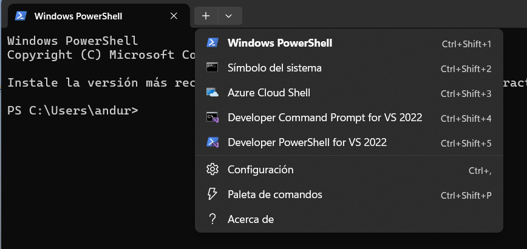

# 🛠️ Guía: Integración de Git Bash en Windows Terminal

Este manual detalla los pasos para configurar **Git Bash** como un perfil personalizado dentro de la **Windows Terminal**, mejorando el flujo de trabajo y la estética del entorno.

---

## 🚀 Pasos a seguir

### 1. Instalación de Git
* Descarga el instalador desde el sitio oficial: [git-scm.com/install](https://git-scm.com/install/).
* **Instalación:** Durante el proceso, selecciona **"Next"** en todas las ventanas para mantener la configuración predeterminada.

### 2. Icono de Git
* Asegúrate de tener el archivo `git-bash.ico` disponible. 
Puedses descargarlo [aquí](images/git-bash.ico)

### 3. Acceder a la Configuración
* Abre **Windows Terminal**.
* Haz clic en el botón de la flecha hacia abajo (v) en la barra superior y selecciona **Configuración**.

> *Ubicación del menú de configuración.*

### 4. Crear un Nuevo Perfil
* En la barra lateral izquierda, desplázate hasta el final y selecciona **+ Agregar nuevo perfil**.
* Haz clic en **+ Nuevo perfil vacío**.

### 5. Configuración General
Completa los campos con la siguiente información:

* **Nombre:** `Git`  
    *(Este es el nombre que se mostrará en la pestaña de la terminal).*
* **Línea de comandos:** `C:\Program Files\Git\bin\bash.exe`  
    *(Esto asegura que se ejecute el motor de Bash directamente).*
* **Directorio de inicio:** `F:\programas\gitProjects`  
    *(Define tu carpeta de proyectos para que la terminal se abra allí automáticamente).*

### 6. Personalización del Icono
Para que el perfil sea fácilmente identificable:
* En el apartado **Icono**, establece la ruta donde se encuentra el archivo `.ico`.
* Ruta recomendada: `C:\Program Files\Git\bin\git-bash.ico`

---

## 📝 Resumen de Configuración

| Propiedad | Valor Sugerido |
| :--- | :--- |
| **Nombre del Perfil** | `Git` |
| **Ruta del Ejecutable** | `C:\Program Files\Git\bin\bash.exe` |
| **Ruta del Icono** | `C:\Program Files\Git\bin\git-bash.ico` |
| **Carpeta de Trabajo** | `F:\programas\gitProjects` |

---
_Manual de configuración - Entorno de Desarrollo_
