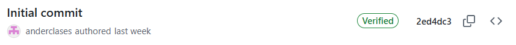
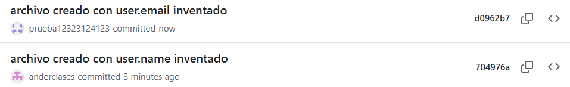
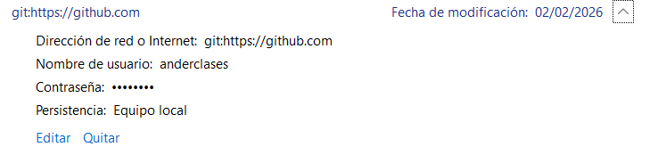
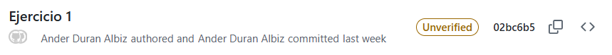
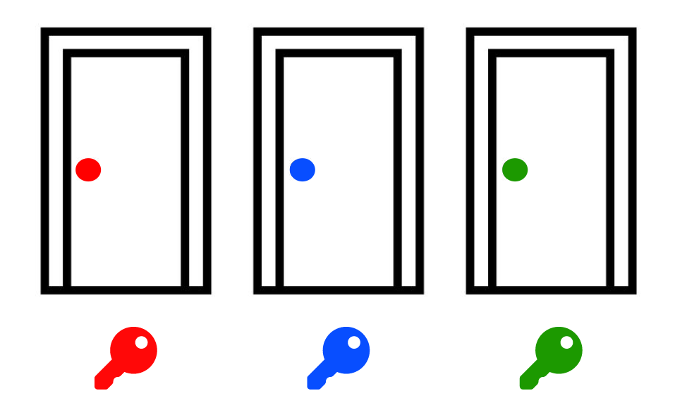

## Estados de Commit en Git

### Estado Inicial


Se puede observar que el commit inicial muestra el usuario correcto que coindide con la cuenta de git desde la que se ha creado el repositorio.

Al ser un commit que se realiza desde la cuenta de github, no hay ninguna configuración local que afecte a este commit.

---

### Usuario correcto y firma verificada

Para que el commit se vea en este estado el user.email y user.name deben de coincidir con el de la cuenta de github.

Además pone verified, para que esto ocurra se deben de cumplir estas 3 condiciones:
1. En tu PC: El user.email de tu configuración de Git debe ser idéntico al correo electrónico dentro de tu llave GPG.

2. En GitHub: El correo electrónico de la llave GPG debe estar registrado y verificado en tu configuración de correos de GitHub (Settings > Emails).

3. En el Commit: El correo con el que haces el commit debe ser el mismo que GitHub tiene asociado a tu cuenta.

---

### Usuario coincide pero sin firmar


Este es el nombre de usuario y email que estan realizando el commit oficialmente. Simplemente significa que el commit ha sido realizado afimrnado que ese usuario y contraseña son esos. 

En este caso el commit no ha recibido ninguna firma digital con GPG, lo que significa que Git no puede garantizar que el autor sea realmente quien dice ser.

Git cuando no tiene firmas traga todos los cambios que hagamos, aquí lo podemos ver con un ejemplo:s

Para llevar a cabo lo que se ve en la siguiente captura se han hecho estos dos comandos

```bash
git config --global user.name "Bill Gates"
git config --global user.email "inventado@gmail.com"
```



Podemos ver cómo github prioriza el user email para mostrar cual es la cuanta que cree que ha hecho el commit. Por eso al cambiar solo el user.name sigue mostrando mi cuenta personal. Mientras que cuando cambio el email muestra el usuario existente en el sistema de github que está registrado a ese email.

https://github.com/prueba12323124123

**¿Esto significa que la persona que creó esta cuenta puede editar mi repositorio?**

No, para editar mi repositorio github no utiliza mi user.name ni user.email (estos datos solo se registran como autores del commit).

Para editar mi repositorio es necesario crear una credencial de acceso. Cuando lo hacemos desde windows podemos ver si nuestra credencial existe en el administrador de credenciales.



---

### Usuario no coincide y firma no verificada


Podemos ver que la cuenta del usuario está en gris y que está mostrando un nombre de usuario. 

Para este commit no he hecho ningún cambio en user.name y user.email. Los datos que ha utilizado son de un ordenador administrado por otra entidad (no es un ordenador personal).

Los ordenadores administrados suelen tener un nombre de usuario asignado y un email por defecto a ese usuario, un email que aunque no exista a nivel de servicio, está asignado al usuario. Este email podria ser andur@hezkuntza.net.

Por eso ocurre que el commit está realizado por una cuenta con nombre de usuario pero github lo muestra gris porque no existe ninguna cuenta en github logueada con ese email.


```php
git config --list | grep user
user.email=anderduirakasle@gmail.com
user.name=anderclases
```

---

### Usuario coincide pero firma no verificada

Si firmas un commit con una llave GPG que no has subido a tu configuración de GitHub, verás el estado "Unverified" (No verificado).


También puede ser que la clave GPG esté caducada.

Con el comando `gpg --list-secret-keys --keyid-format=LONG` se puden listar las claves que hay en el equipo.

Luego podemos exportar la clave pública `gpg --armor --export TU_ID`

Que si la subimos a nuestra cuenta de github aceptará esos commits como nuestros.

Nosotros firmamos con nuestra clave privada que está ubicada en nuestro ordenador. Github al tener nuestra clave publica guardada puede comporbar que el commit ha sido firmado con esa clave privada.

Una buena metafora de la criptografía asimetrica es la de la llave y el candado.


