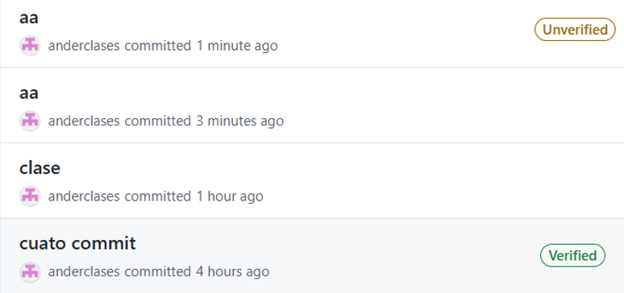
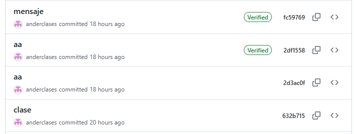

# 🚀 Guía Rápida de Configuración de Git y GitHub

Este manual describe los pasos fundamentales para crear un repositorio, clonarlo localmente y realizar el primer commit de forma correcta.

---

## 1. Inicio y Creación del Repositorio

1. **Inicia sesión** en tu cuenta de [GitHub](https://github.com).
2. **Crea un nuevo repositorio** haciendo clic en el botón **"+"** en la esquina superior derecha.


---

## 2. Clonar el Repositorio

Una vez creado en la web, tráelo a tu equipo local utilizando el comando de clonado:


```bash
git clone <url-de-tu-repositorio>
```

---


## 3. Preparar el Primer Commit

Para registrar cambios en Git, seguimos un flujo de trabajo de preparación. En la siguiente captura se pueden ver estos primeros pasos:

### Comandos utilizados:

- `touch hola`
    Genera un archivo llamado **hola**.
    
- `git status`
    Podemos ver que el archivo está creado, pero no está añadido (_untracked_).
    
- `git add .`
    Añadimos todos los archivos al área de preparación.
    
- `git status`
    Ahora vemos cómo el archivo está correctamente añadido y listo para el commit.
    
- `git commit -m "hola"`
    Crea un commit cuyo mensaje es "hola".

---

## 4. Configuración de Identidad

Al hacer el commit, si el equipo no tiene un email ni usuario configurados, Git dará un error ya que esta información es obligatoria.

> **Nota:** Es posible que en los ordenadores de clase no ocurra este error, ya que suelen estar pre-configurados. De lo contrario, usa estos comandos:


```bash
git config --global user.email "you@example.com"
git config --global user.name "Your Name"
```

---

## 5. Comprobar email y nombre de usuario 

En el lado izquierdo clica en el icono de usuario y selecciona **Settings**. El nombre de usuario se puede ver desde muchos sitios y es fácil de encontrar.

Es importante seleccionar **acces** > **emails** y ahí comprobar que el email que damos a `git config` esta entre los emails validados

Al repetir el commit podemos ver que ha funcionado
```bash
$ git commit -m "hola"
[main (root-commit) 4ad8a1c] hola
 1 file changed, 0 insertions(+), 0 deletions(-)
 create mode 100644 hola
```

---


## 6. Conexión con github
Ahora escribimos el comando `git push`, para realizar el push, la terminal debe de estar conectada con nuestra cuenta de github.

Al hacer `git push` si no hemos enlazado nuestra cuenta de github con nuestra terminal nos va a pedir que iniciemos sesión.


Tras iniciar sesión nos pide autorizar el permiso, simplemente tenemos qu aceptar.


Al **haber enlazado nuestra terminal** con nuestra cuenta de github podemos ver cómo el push se completa y se puede ver el commit en la **interfaz online**.


---

## 7. Firmar y verificar Commit
Para que tus commits aparezcan con la etiqueta "Verified" en verde en GitHub, necesitas **firmarlos digitalmente**. GitHub utiliza el estándar GPG, SSH o S/MIME para verificar que el commit realmente lo hiciste tú.
GPG, que es el método más común.

### 7.1. Generar clave

Mediante este comando iniciamos la **herramienta de generación de firmas**.
- Se recomienda que el tamaño del RSA sea el maximo 4096.
- Para pruebas es más cómodo usar llaves que no caducan. (opción 0)
- Las firmas deben de estar relacionadas con una persona real y un email de contacto.
    - Real name: Ander Duran
    - Email address: miemail@gmail.com
```bash
gpg --full-generate-key
```

### 7.2. Habilitar clave en github
#### 1. Generar una clave GPG
Primero, **lista tus claves** para obtener el ID:
```bash
gpg --list-secret-keys --keyid-format=LONG
```
#### 2. Exportar la clave pública
**Copia el ID** que aparece después de rsa4096/ (por ejemplo: 3AA5C34371567BD2). Luego expórtala:
```bash
gpg --armor --export TU_ID_DE_CLAVE
```
#### 3. Añadir la clave a GitHub
1. Ve a Settings > SSH and GPG keys > **New GPG key**.
2. Pega el bloque de texto que empieza por -----BEGIN PGP PUBLIC KEY BLOCK-----.

#### 4. Configurar Git para firmar siempre
Ejecuta estos comandos en tu terminal para que Git firme tus commits automáticamente:

Establece tu clave para que sea la firmante.
```bash
git config --global user.signingkey TU_ID_DE_CLAVE
```

Haz que las firmas ocurran por defecto.
```bash
git config --global commit.gpgsign true
```


#### 5. Resultado final 

Este es el resultado final que esperamos


#### 6. Mejorar experiencia
Se considera que la herramienta de gpg4win es mejor que la que tiene pordefecto la terminal, además aquí podemos guardar la clave para redicir la cantidad de veces que debemos escribirla.
**Listamos las claves** para ver la que queremos exportar:
```bash
gpg --list-secret-keys --keyid-format=LONG
```

Desde git bash, vamos a exportar la clave que hemos generado, las claves se almacenan en username/.gnupg y hay que tener el cuenta que el path absoluto es el modelo de git bash. 
Exportar la clave generada
```bash
gpg --homedir "/c/Users/andur/.gnupg" --export-secret-keys --armor TU_ID_DE_CLAVE > mi_clave_privada.asc
```

**1. Descarga e Instalación**
1. Ve a la página oficial: [gpg4win.org](https://gpg4win.org/).
2. Haz clic en el botón Download. (Puedes poner $0 en la donación si quieres ir directo a la descarga gratuita).
3. Ejecuta el instalador .exe.
4. En la selección de componentes, asegúrate de que Kleopatra esté marcado (es el gestor gráfico de claves que facilita mucho el trabajo).


**2. Configurar Git para usar Gpg4win**
Una vez instalado, debes decirle a Git exactamente dónde está el programa de GPG de Windows para que no use el que viene por defecto en la consola, que a veces da problemas con las contraseñas.

Abre tu terminal (Git Bash o CMD) y escribe:
```bash
git config --global gpg.program "C:\Program Files (x86)\GnuPG\bin\gpg.exe"
git config --global gpg.program
# Solo ejecutar para deshacer
git config --global --unset gpg.program
git config --global --list
```

**3. Importa la contraseña que habías exportado**
UsaKleopatra para importar `mi_clave_privada.asc`.

**4. Guardar la contraseña (Passphrase)**
1. La próxima vez que hagas un git commit -m "mensaje", se abrirá una ventana emergente de Windows (de Kleopatra/Gpg4win):
2. Escribe tu contraseña.
3. Marca la casilla que dice "Save in password manager" o "Recordar contraseña".
4. A partir de ahora, Git firmará tus commits automáticamente sin interrumpirte.

---

## 8. Analizando Commits firmados

A nivel de github puede ocurrir que una firma aparezca como no ferificada, eso significa que el commit a nivel local ha sido correctamete firmado, pero que la clave GPG o SSH que se ha usado para hacer la firma no esta añadida como una clave reconocida por nuestro usuario de git, de manera que está firmado pero no verificado.



A nivel de terminal también podemos comprobar las firmas, este comando nos informa de los commits que se han hecho y su están correctamente firmados.
- G firma correcta.
- E Firma en la que detecta un error.
- N siginifica no firmado.
```bash
$ git log --pretty='%h %s [%G?]'
fc59769 mensaje [E]
2df1558 aa [E]
2d3ac0f aa [N]
632b715 clase [N]
e1900bd cuato commit [G]
```

En este caso estos errores son nomrmales, si vemos en github aparecen correctamente firmadas, pero en cambio mi terminal detecta una firma pero no les da el OK con [G]. Esto se debe a que esas firmas se han hecho en otro equipo con otra clave GPG, por eso git lo reconoce pero el equipo en el que se ha ejecutado el comando no las reconoce.




### Posibles errores

También nos puede pasar que al tratar de hacer un commit recibamos un error:
```bash
git commit -m "prueba commit"
```
> [!ERROR] 
> error: Couldn't load public key CLAVE_FIRMA: No such file or directory?

### Reinicio de trabajo

Este error significa que no está encontrando la key, es un error a nivel local ya que no puede firmar el commit. esto ocurre si hemos configurado mal la firma, la recomendacion es **borrar todo y empezar de 0**.

Comando para 
```bash
gpg --delete-secret-key CLAVE_FIRMA
```

Una de las causas posibles del conflicto y es si se han habilitado las firmas por ssh.
```bash 
git config --global --unset user.signingkey # Elimina la clave GPG configurada para firmar commits
git config --global --unset gpg.program # Elimina el programa GPG configurado para firmar commits
git config --global --unset commit.gpgsign # Elimina la opción que obliga a firmar todos los commits
```


### Configuracion esperada
Esta es la configuración mínima esperada para que las firmas nos funcionen.
```bash
$ git config --global --list
user.email=TU_EMAIL
user.name=GITHUB_USERNAME
user.signingkey=CLAVE_FIRMA
commit.gpgsign=true
gpg.program=C:\Program Files (x86)\GnuPG\bin\gpg.exe
```