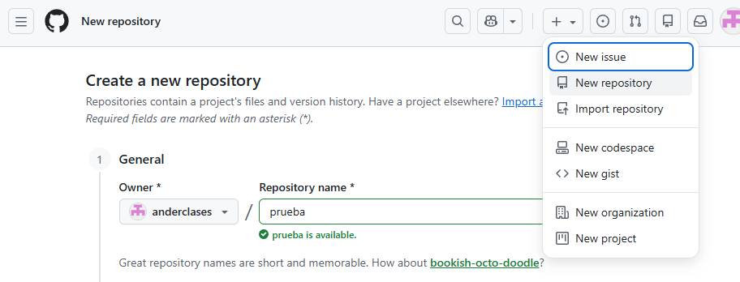
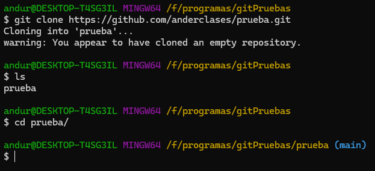
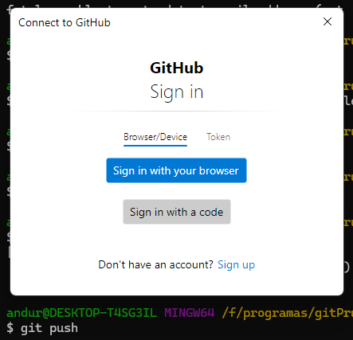
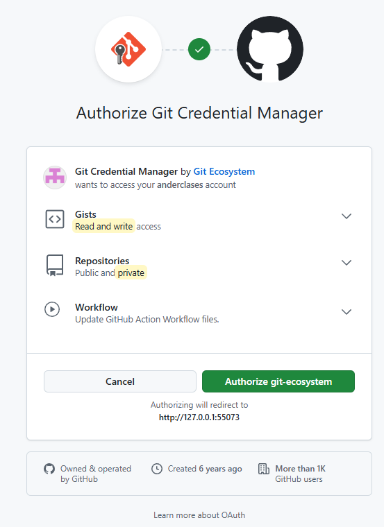
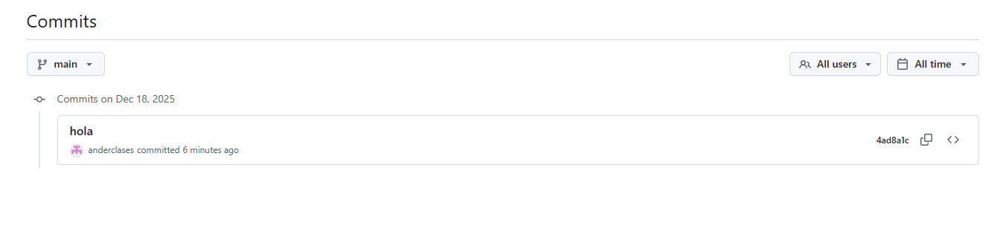
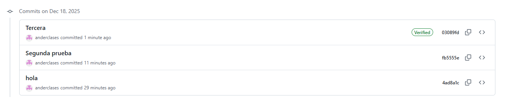

# 🚀 Guía Rápida de Configuración de Git y GitHub

Este manual describe los pasos fundamentales para crear un repositorio, clonarlo localmente y realizar el primer commit de forma correcta.

---

## 1. Inicio y Creación del Repositorio

1. **Inicia sesión** en tu cuenta de [GitHub](https://github.com).
2. **Crea un nuevo repositorio** haciendo clic en el botón **"+"** en la esquina superior derecha.



---

## 2. Clonar el Repositorio

Una vez creado en la web, tráelo a tu equipo local utilizando el comando de clonado:



```bash
git clone <url-de-tu-repositorio>
## 3. Preparar el Primer Commit

Para registrar cambios en Git, seguimos un flujo de trabajo de preparación. En la siguiente captura se pueden ver estos primeros pasos:

### Comandos utilizados:

- `touch hola`
    Genera un archivo llamado **hola**.
    
- `git status`
    Podemos ver que el archivo está creado, pero no está añadido (_untracked_).
    
- `git add .`
    Añadimos todos los archivos al área de preparación.
    
- `git status`
    Ahora vemos cómo el archivo está correctamente añadido y listo para el commit.
    
- `git commit -m "hola"`
    Crea un commit cuyo mensaje es "hola".
    

---

## 4. Configuración de Identidad

Al hacer el commit, si el equipo no tiene un email ni usuario configurados, Git dará un error ya que esta información es obligatoria.

> **Nota:** Es posible que en los ordenadores de clase no ocurra este error, ya que suelen estar pre-configurados. De lo contrario, usa estos comandos:


```bash
git config --global user.email "you@example.com"
git config --global user.name "Your Name"
```

---

## 5. Comprobar email y nombre de usuario 

En el lado izquierdo clica en el icono de usuario y selecciona **Settings**. El nombre de usuario se puede ver desde muchos sitios y es fácil de encontrar.

Es importante seleccionar **acces** > **emails** y ahí comprobar que el email que damos a `git config` esta entre los emails validados

Al repetir el commit podemos ver que ha funcionado
```bash
$ git commit -m "hola"
[main (root-commit) 4ad8a1c] hola
 1 file changed, 0 insertions(+), 0 deletions(-)
 create mode 100644 hola
```

## 6. Conexión con github
Ahhora escribimos el comando `git push`, para realizar el push, la terminal debe de estar conectada con nuestra cuenta de github.

Podemos ver que nos pide iniciar sesión.


Tras iniciar sesión nos pide autorizar el permiso




## 7. Verificar Commit
Para que tus commits aparezcan con la etiqueta "Verified" en verde en GitHub, necesitas firmarlos digitalmente. GitHub utiliza el estándar GPG, SSH o S/MIME para verificar que el commit realmente lo hiciste tú.
GPG, que es el método más común.

### 7.1. Generar clave
```bash
gpg --full-generate-key
gpg (GnuPG) 2.4.8; Copyright (C) 2025 g10 Code GmbH
This is free software: you are free to change and redistribute it.
There is NO WARRANTY, to the extent permitted by law.

gpg: directory '/c/Users/andur/.gnupg' created
Please select what kind of key you want:
   (1) RSA and RSA
   (2) DSA and Elgamal
   (3) DSA (sign only)
   (4) RSA (sign only)
   (9) ECC (sign and encrypt) *default*
  (10) ECC (sign only)
  (14) Existing key from card
Your selection? 1
RSA keys may be between 1024 and 4096 bits long.
What keysize do you want? (3072) 4096
Requested keysize is 4096 bits
Please specify how long the key should be valid.
         0 = key does not expire
      <n>  = key expires in n days
      <n>w = key expires in n weeks
      <n>m = key expires in n months
      <n>y = key expires in n years
Key is valid for? (0) 0 # Indica que no caduca nunca
Key does not expire at all
Is this correct? (y/N) y

GnuPG needs to construct a user ID to identify your key.
Real name: Ander Duran
Email address: miemail@gmail.com
Comment:
You selected this USER-ID:
    "Ander Duran <miemail@gmail.com>"

Change (N)ame, (C)omment, (E)mail or (O)kay/(Q)uit? O
```
### 7.2. Habilitar clave en github
#### 1. Generar una clave GPG
Primero, lista tu clave para obtener el ID:
```bash
gpg --list-secret-keys --keyid-format=LONG
```
#### 2. Exportar la clave pública
Copia el ID que aparece después de rsa4096/ (por ejemplo: 3AA5C34371567BD2). Luego expórtala:
```bash
gpg --armor --export TU_ID_DE_CLAVE
```
#### 3. Añadir la clave a GitHub
1. Ve a Settings > SSH and GPG keys > New GPG key.
2. Pega el bloque de texto que empieza por -----BEGIN PGP PUBLIC KEY BLOCK-----.

#### 4. Configurar Git para firmar siempre
Ejecuta estos comandos en tu terminal para que Git firme tus commits automáticamente:
```bash
git config --global user.signingkey TU_ID_DE_CLAVE
git config --global commit.gpgsign true
```

#### 5. Resultado final 

Este es el resultado final que esperamos


#### 6. Mejorar experiencia
Para que no nos pida siempre la clave

Exportar la clave generada
```bash
gpg --list-secret-keys --keyid-format=LONG
gpg --homedir "/c/Users/andur/.gnupg" --export-secret-keys --armor TU_ID_DE_CLAVE > mi_clave_pri
vada.asc
```

**1. Descarga e Instalación**
1. Ve a la página oficial: gpg4win.org.
2. Haz clic en el botón Download. (Puedes poner $0 en la donación si quieres ir directo a la descarga gratuita).
3. Ejecuta el instalador .exe.
4. En la selección de componentes, asegúrate de que Kleopatra esté marcado (es el gestor gráfico de claves que facilita mucho el trabajo).


**2. Configurar Git para usar Gpg4win**
Una vez instalado, debes decirle a Git exactamente dónde está el programa de GPG de Windows para que no use el que viene por defecto en la consola, que a veces da problemas con las contraseñas.

Abre tu terminal (Git Bash o CMD) y escribe:
```bash
git config --global gpg.program "C:\Program Files (x86)\GnuPG\bin\gpg.exe"
git config --global gpg.program
# Solo ejecutar para deshacer
git config --global --unset gpg.program
git config --global --list
```

**3. Importa la contraseña que habías exportado**
UsaKleopatra para importar `mi_clave_privada.asc`.

**4. Guardar la contraseña (Passphrase)**
1. La próxima vez que hagas un git commit -m "mensaje", se abrirá una ventana emergente de Windows (de Kleopatra/Gpg4win):
2. Escribe tu contraseña.
3. Marca la casilla que dice "Save in password manager" o "Recordar contraseña".
4. A partir de ahora, Git firmará tus commits automáticamente sin interrumpirte.